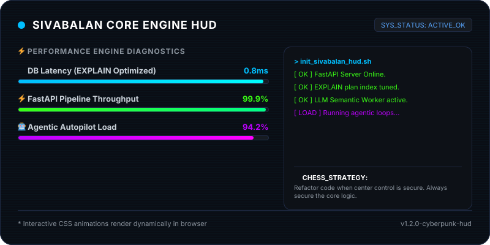
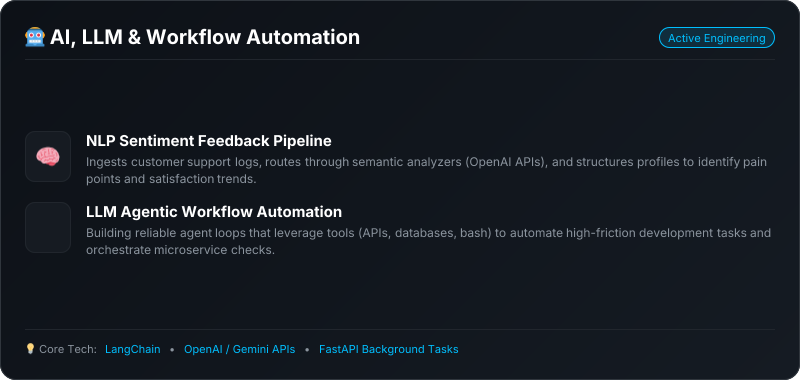

***

### 🚀 About Me

I am a **Senior Software Developer** with a passion for designing and optimizing robust backends, microservice architectures, and modern API engines. I bring engineering concepts to life by focusing on clean, scalable code, advanced database performance tuning, and building intelligent automation workflows.

* ⚙️ **Distributed Systems**: Engineering responsive microservices and high-throughput async APIs using FastAPI, Flask, and Tornado.
* ⚡ **Performance Tuning**: Turning slow, sequential database queries into sub-millisecond lookups using query optimization and `EXPLAIN` plan analysis.
* 🤖 **Intelligent Workflows**: Exploring and integrating NLP, semantic analyzers, and background workers into reliable data aggregation pipelines.
* ♟️ **Architectural Philosophy**: *"Great software is like chess — control the center (core logic), understand value (trade-offs), and know when to retreat (refactor)."*

***

### 📊 Real-Time GitHub Analytics

  

  

***

***

***

***

### 💬 Let's Connect

  
  
  

