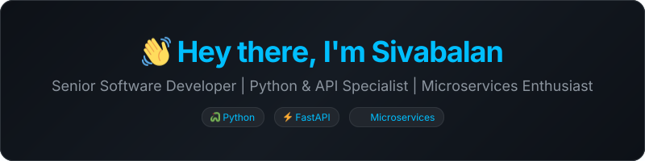
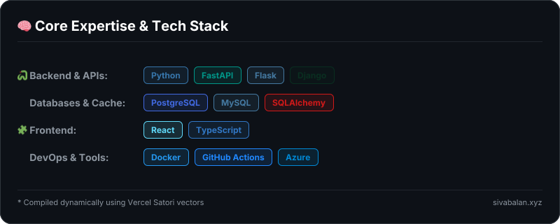
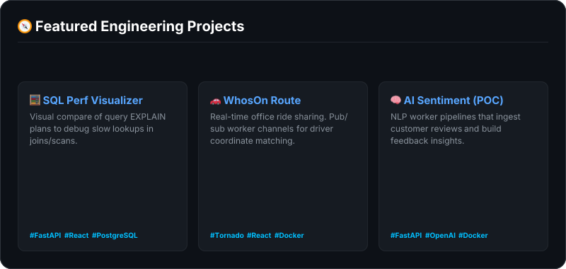

# 🌟 Sivabalan's Profile (Source Template)

This file (`readme.source.md`) is designed to compile directly into your final `README.md` using the **`readme-aura`** engine from the Reddit thread.

It wraps React / JSX code directly in \`\`\`aura blocks which render to premium, crisp SVGs at build-time.

***

<!-- Aura block: Header & Greeting Card -->

***

### 🚀 About Me

I'm a **Senior Software Developer** specializing in designing and optimizing robust backends, microservice architectures, and modern API engines. I bring ideas to life by focusing on clean code, database performance tuning, and integrating intelligent automation workflows.

* ⚙️ **Current Focus**: Designing distributed event-driven systems using FastAPI & Docker.
* ⚡ **Performance Obsession**: Turning slow `EXPLAIN` query paths into sub-millisecond lookups.
* 🤖 **AI Exploration**: Building intelligent agents and workflow automation that remove daily friction.
* ♟️ **Philosophy**: "Great software is like chess — control the center (core logic), understand value (trade-offs), and know when to retreat (refactor)."

***

### 📊 Real-Time GitHub Analytics

<table align="center" border="0" cellpadding="0" cellspacing="0" width="100%">
  <tr>
    <td align="center" width="50%" valign="top">
      
    </td>
    <td align="center" width="50%" valign="top">
      
    </td>
  </tr>
</table>

  

***

<!-- Aura block: Core Tech Stack Grid Card -->

***

<!-- Aura block: Highlights Dashboard Card -->

***

### 💬 Let's Connect

  
  
  

